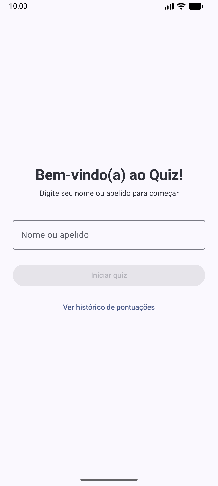
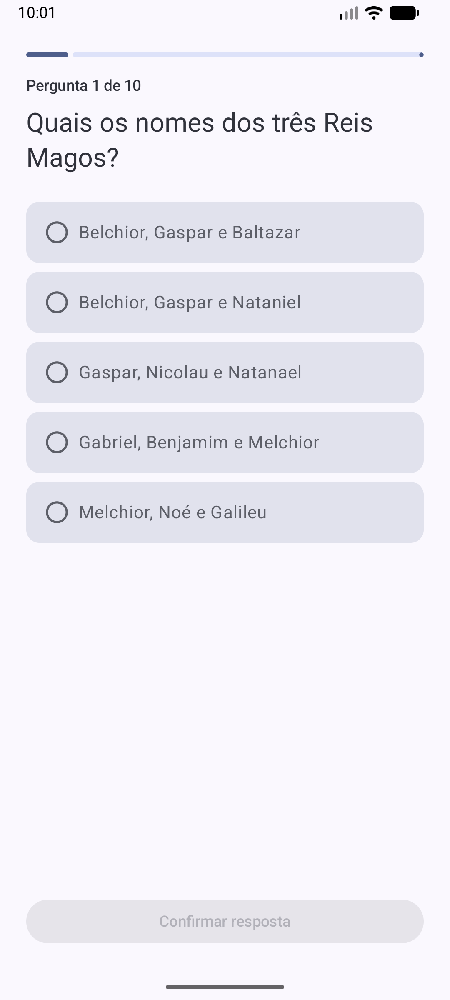
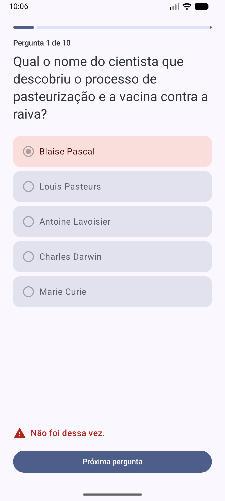

# Dynamox Android Developer Challenge — Quiz App

A native Android quiz app built with **Kotlin** and **Jetpack Compose** for the Dynamox
Android Developer Challenge. The player enters a name, answers 10 multiple-choice
questions fetched from the challenge backend, gets immediate feedback on each answer,
sees a final score, can restart, and can browse every player's score history.

<p align="center">
  
  
  
  
</p>
<p align="center">
  
  
</p>

All screenshots above were captured from a real run on an Android emulator (API 37),
including a full app restart before the history screenshot, to confirm scores are
actually persisted to disk rather than kept only in memory.

## Requirements coverage

### Mandatory

- [x] Written in **Kotlin**.
- [x] **Jetpack Compose** for every screen (Material 3).
- [x] Local persistence of players and scores (**Room**) — see the score history screen.
- [x] Automated **unit tests** covering the core business logic (18 JVM tests).

### Bonus

- [x] **Dependency Injection** with **Hilt**.
- [x] **Kotlin Coroutines + Flow** for all asynchronous/reactive work.
- [x] Consistent Material 3 design (dynamic color on Android 12+), custom launcher
      icon, and animations: slide/fade transitions between screens, an animated
      progress bar, animated option-selection colors, and an animated reveal of the
      correct/incorrect feedback.
- [x] **Layered architecture**: `data` / `domain` / `ui`, each with a single responsibility.
- [x] Design patterns: **Repository** (abstracts the data sources from the domain) and
      **Use Case** (one class per business operation, e.g. `GetUniqueQuestionUseCase`).
- [x] **Consistent error handling**: HTTP responses are mapped to a small `AppError`
      sealed class with one case per status code called out by the challenge —
      `BadRequest` (400), `NotFound` (404), `ServerError` (5xx) — plus `Network` and
      `Unknown`, so the UI never deals with raw HTTP codes or exceptions.
- [x] **Integration tests** for the main business logic (MockWebServer + an instrumented
      Room test) — 2 extra tests beyond the mandatory unit tests, 20 in total.
- [x] This **README** with setup instructions, architecture and documented assumptions.
- [x] **CI** (GitHub Actions) running the full test suite and a debug build on every push.

## Requirements NOT pursued (and why)

- **Docker**: the challenge's "Quality & DevOps" bonus mentions Docker as one option to
  document how to run the project locally. A native Android app has no server component
  to containerize — the only way to run/build it is the standard Android toolchain
  (Gradle + Android SDK), which is what this README documents instead.

## Getting started

### Prerequisites

- **Android Studio** (Ladybug or newer) — the easiest way to open, run and test the
  project, or:
- **JDK 17**
- **Android SDK** with platform **37** and build-tools **37.0.0+** installed
- An Android device or emulator running **API 26+** (`minSdk`)

### Clone and open

```bash
git clone https://github.com/eduarduamaral/developer-challenges.git
cd developer-challenges/android-challenge
```

Open the `android-challenge/` folder in Android Studio (not the repository root — this
solution lives in its own subfolder since the parent repository is a monorepo of
challenge prompts) and let it sync, or use the command line with the included Gradle
wrapper:

```bash
./gradlew tasks
```

### Run the app

From Android Studio: select the `app` run configuration and press Run. From the
command line, with a device/emulator connected:

```bash
./gradlew installDebug
```

### Run the tests

```bash
# Unit tests (JVM, fast, no device needed)
./gradlew testDebugUnitTest

# Instrumented tests (needs a connected device/emulator; exercises the real Room/SQLite implementation)
./gradlew connectedDebugAndroidTest
```

### Build a debug APK

```bash
./gradlew assembleDebug
# output: app/build/outputs/apk/debug/app-debug.apk
```

## Backend API

The app talks to the public challenge backend:

- `GET /question` → returns a random question
- `POST /answer?questionId=$id` → checks the submitted answer

No API key or configuration is required; the base URL is hardcoded in
[`NetworkModule`](app/src/main/java/com/dynamox/quizchallenge/di/NetworkModule.kt),
which is the usual place to look if it ever needs to change (e.g. to point at a mock
server for manual testing).

## Architecture

The app follows a simple layered architecture, split by responsibility rather than by
feature, which keeps each layer's purpose obvious for a project this size:

```
com.dynamox.quizchallenge
├── data                     # "how": talks to the network and the database
│   ├── remote               #   Retrofit API, DTOs, HTTP -> AppError mapping
│   ├── local                #   Room: entity, DAO, database
│   └── repository           #   Repository implementations
├── domain                   # "what": framework-agnostic business rules
│   ├── model                #   Question, QuizSession, PlayerScore, AppError
│   ├── repository           #   Repository interfaces (implemented by `data`)
│   └── usecase               #   One class per business operation
├── di                       # Hilt modules wiring network/database/repositories
└── ui                       # Compose screens, ViewModels, navigation, theme
    ├── nameentry / quiz / result / history
    ├── navigation
    └── theme
```

`domain` only depends on Kotlin/coroutines — it has no Android or Retrofit/Room
imports, so its use cases are trivial to unit test in plain JVM tests. `data` depends on
`domain` (implements its repository interfaces) and on Retrofit/Room. `ui` depends on
`domain` only, through Hilt-injected use cases; it is never aware that the network or
Room even exist.

### Key design decisions

- **Repository + Use Case pattern.** Each `XxxUseCase` wraps exactly one business
  operation (e.g. `SubmitAnswerUseCase`, `SaveScoreUseCase`). ViewModels orchestrate use
  cases; they contain no networking or persistence code themselves.
- **`QuizSession` as an immutable value.** Quiz progress (current question index, score,
  which question IDs have been seen) is a single immutable `data class` rather than a
  handful of `var`s scattered across the ViewModel. Every transition
  (`session.withAnswer(...)`) returns a new value, which makes the state trivial to unit
  test and reason about.
- **Duplicate-question mitigation lives in the domain layer, not the ViewModel.** The
  public `/question` endpoint returns a random question on every call and does **not**
  exclude questions already served in the current run — repeats are possible within a
  10-question quiz (confirmed by manually calling the endpoint repeatedly during
  development). `GetUniqueQuestionUseCase` retries fetching a question up to 5 times
  when it detects a repeat, and falls back to accepting the repeat rather than ever
  leaving the player stuck in a retry loop. Living in the domain layer (instead of the
  ViewModel) keeps this rule fully unit-testable without any Android dependencies.
- **Consistent error handling.** `safeApiCall` (in `data/remote/ApiErrorMapper.kt`) is
  the single place that turns Retrofit/OkHttp exceptions and HTTP status codes into a
  small `AppError` sealed class, modeled after the specific status codes called out by
  the challenge (400/404/500) rather than broad "4xx/5xx" buckets. This includes a real
  quirk of the backend discovered while testing it manually: an invalid `questionId`
  returns HTTP **400** (mapped to `AppError.BadRequest`) with a **plain text** body
  (`"400 BAD REQUEST: Question not found."`), not JSON, and not a 404 as REST
  conventions might suggest — the error mapper only looks at the status code, so it
  doesn't matter whether the body is JSON or not, and this exact scenario (plus a
  synthetic 404 case, since the real backend never actually returns one) is covered by
  integration tests.
- **`NameEntryScreen` intentionally has no ViewModel.** Its only state is the text the
  player is typing, which `rememberSaveable` already survives configuration changes and
  process death; adding a ViewModel here would only add ceremony without adding
  behavior.
- **Score history screen.** User story 3.2 ("I want to save the score of every quiz I
  made, so that I can visualize the score of every user at all times") is treated as a
  real screen, not just silent persistence — reachable both from the name entry screen
  and from the result screen.

### Business-rule assumptions (documented per the challenge's instructions)

- **Restarting the quiz** ("Jogar novamente") keeps the same player name and starts a
  fresh 10-question run with a reset score — this felt like the most natural reading of
  "restart the quiz with new questions". A separate "Trocar de jogador" (change player)
  action is available to go back to the name entry screen.
- A finished quiz's score is saved to the local database **exactly once**, right after
  the 10th answer is revealed.
- The app copy (question statements aside, which come from the backend) is in
  **Portuguese**, matching the language of the quiz content and of the company; this
  README and all code/comments are in English.

## Dependency versions

Dependency versions were resolved by querying the live Google Maven / Maven Central
`maven-metadata.xml` for each artifact at the time of writing (rather than assumed from
memory), picking the latest stable (non-alpha/beta/RC) release of each. All versions are
centralized in [`gradle/libs.versions.toml`](gradle/libs.versions.toml) (Gradle version
catalog).

One noteworthy compatibility note: this project uses **Android Gradle Plugin 9's
built-in Kotlin support**, so there is no separate `org.jetbrains.kotlin.android` plugin
applied — Kotlin compiler options that used to live under `android.kotlinOptions {}` now
live in a top-level `kotlin { compilerOptions {} }` block in
[`app/build.gradle.kts`](app/build.gradle.kts). This is required because the Hilt Gradle
plugin version available at the time only supports AGP 9+.

## Testing strategy

20 automated tests in total:

| Type | Location | What it covers |
|---|---|---|
| Unit (JVM) | `app/src/test/.../domain/usecase/GetUniqueQuestionUseCaseTest.kt` | Duplicate-question retry/fallback logic |
| Unit (JVM) | `app/src/test/.../ui/quiz/QuizViewModelTest.kt` | Full quiz flow: loading, selecting an option, correct/incorrect reveal, advancing, saving the final score on the 10th question, error state + retry |
| Unit (JVM) | `app/src/test/.../ui/history/HistoryViewModelTest.kt` | Empty state and reflecting saved scores |
| Integration (JVM + MockWebServer) | `app/src/test/.../data/repository/QuizRepositoryImplTest.kt` | Exercises the real Retrofit/OkHttp/kotlinx.serialization wiring against a local HTTP server, including the plain-text HTTP 400 body observed from the real backend |
| Integration (instrumented) | `app/src/androidTest/.../data/local/PlayerScoreDaoTest.kt` | Room DAO against a real SQLite implementation on a device/emulator |

ViewModel tests use hand-written fakes (`FakeQuizRepository`, `FakeScoreRepository`)
rather than mocks wherever a simple in-memory implementation was clearer to read;
MockK is used where mocking call sequences/verifications is a better fit (use case
tests). [Turbine](https://github.com/cashapp/turbine) is used to assert `StateFlow`
emissions in ViewModel tests.

## Continuous Integration

[`.github/workflows/android-ci.yml`](https://github.com/eduarduamaral/developer-challenges/blob/eduardo-amaral/.github/workflows/android-ci.yml)
(at the repository root) runs on every push to this branch and on pull requests
targeting `main`: it runs the unit test suite and builds a debug APK, uploading the unit
test report as a workflow artifact.
